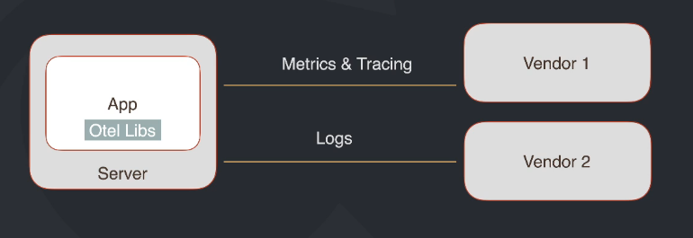
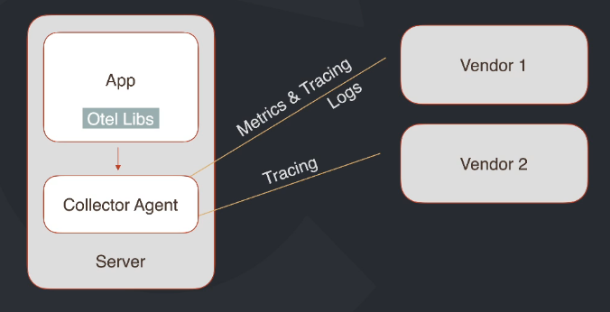
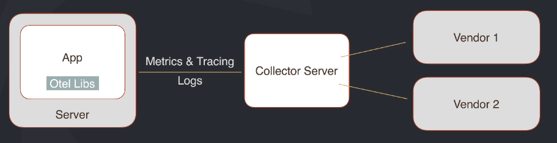

### O que é "Observabilidade"?

Baseando-se nas saídas do sistema, podemos inferir o que pode estar acontecendo dentro do sistema. Saídas como resultados
de erro, uso de recursos...

### Observabilidade vs monitoramento

**Monitoramento** nos mostra que há algo errado, se baseia em saber com antecedência quais sinais queremos monitorar
(Sistema tá no ar, quantos usuários estão online, qual é o uso da CPU...), monitoramentos geralmente andam junto com "alarmes",
notificações baseadas no que está sendo monitorado e seu valor.
Já a **Observabilidade** nos permite perguntar o porquê (por que o uso de memória está alta, por que o uso de CPU está alta,
por que ninguém está visitando o site em horário de pico...).

### Pilares da observabilidade

- **Métricas**: Qualquer coisa que pode ser medida e normalmente de forma absoluta. Ex.: CPU, memória, erros, usuários, vendas...
- **Logs**: Evento no passado do que aconteceu com o sistema. Ex.: erros, SQL's executados, o que foi recebido, o que foi enviado...
- **Tracing**: Rastrear a requisição na aplicação. Ex.: Onde a requisição passou, em quais sistemas, em quais funções, quais requests...

### Origem

O OpenTelemetry começou a surgir a partir de projetos como o OpenTracing, OpenCensus que hoje é um projeto mantido pela
CNCF - Cloud Native Computing Foundation.

### Componentes

O Open Telemetry é um framework de observabilidade para softwares cloud native, é um modo de trabalho que possui conjuntos
de ferramentas, API's e SKD's para fazer instrumentação, geração, coleta e exportação de dados de telemetria.
**Principais componentes**:
- Especificações
	- Dados
	- SDK's
	- API's
- Collector
	- Agente ou serviço
	- Pipeline
		- Recebimento
		- Processamento
		- Envio de dados
	- Vendor-Agnostic
- Libs
	- Vendor-Agnostic
	- Tracing e logs
	- Auto tracing
- Logs: Draft

### Arquitetura básica

**Sem collector**:

**Com collector no modo agente**:

**Com collector no modo server**:

